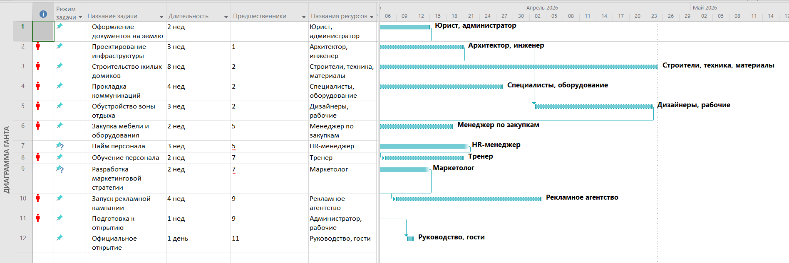
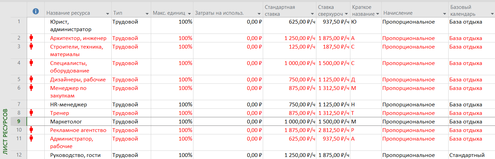

# Лабораторная работа по управлению проектами в MS Project 2010  
## Тема проекта: «Открытие базы отдыха»

## 1. Формулировка проекта  
**Цель:** Создание базы отдыха с инфраструктурой для размещения гостей, организации досуга и обеспечения комфортного отдыха.  
**Дата начала проекта:** 1 марта 2024 года.  

**Основные этапы проекта:**  
1. Подготовка территории (покупка земли, оформление документов).  
2. Проектирование инфраструктуры (жилые домики, зона отдыха, коммуникации).  
3. Строительство объектов.  
4. Закупка оборудования и мебели.  
5. Найм и обучение персонала.  
6. Маркетинг и реклама.  
7. Официальное открытие.  

## 2. Таблица работ  
| № | Название задачи               | Продолжительность | Предшественники | Ресурсы                          |
|---|-------------------------------|-------------------|----------------|----------------------------------|
| 1 | Оформление документов на землю | 2 недели          | —              | Юрист, администратор             |
| 2 | Проектирование инфраструктуры  | 3 недели          | 1              | Архитектор, инженер              |
| 3 | Строительство жилых домиков    | 8 недель          | 2              | Строители, техника, материалы    |
| 4 | Прокладка коммуникаций         | 4 недели          | 2              | Специалисты, оборудование        |
| 5 | Обустройство зоны отдыха        | 3 недели          | 3, 4           | Дизайнеры, рабочие               |
| 6 | Закупка мебели и оборудования  | 2 недели          | 5              | Менеджер по закупкам             |
| 7 | Найм персонала                 | 3 недели          | —              | HR-менеджер                      |
| 8 | Обучение персонала             | 2 недели          | 7              | Тренер                          |
| 9 | Разработка маркетинговой стратегии | 2 недели | —              | Маркетолог                       |
| 10| Запуск рекламной кампании       | 4 недели          | 9              | Рекламное агентство              |
| 11| Подготовка к открытию           | 1 неделя          | 6, 8, 10       | Администратор, рабочие            |
| 12| Официальное открытие            | 1 день            | 11             | Руководство, гости               |

## 3. Таблица ресурсов  
| Название ресурса                  | Тип          | Макс. единиц | Затраты на использование | Стандартная ставка | Ставка сверхурочных | Краткое название | Начисление       | Базовый календарь |
|-----------------------------------|--------------|--------------|--------------------------|--------------------|---------------------|------------------|------------------|-------------------|
| Юрист, администратор              | Трудовой     | 100%         | 0,00 ₽                   | 5000 ₽/день        | 7500 ₽/день         | Ю                | Пропорциональное | База отдыха       |
| Архитектор, инженер               | Трудовой     | 100%         | 0,00 ₽                   | 10000 ₽/день       | 15000 ₽/день        | А                | Пропорциональное | База отдыха       |
| Строители, техника, материалы     | Трудовой     | 100%         | 0,00 ₽                   | 500 ₽/чел./день    | 750 ₽/чел./день     | С                | Пропорциональное | База отдыха       |
| Специалисты, оборудование         | Трудовой     | 100%         | 0,00 ₽                   | 8000 ₽/день        | 12000 ₽/день        | С                | Пропорциональное | База отдыха       |
| Дизайнеры, рабочие                | Трудовой     | 100%         | 0,00 ₽                   | 6000 ₽/день        | 9000 ₽/день         | Д                | Пропорциональное | База отдыха       |
| Менеджер по закупкам              | Трудовой     | 100%         | 0,00 ₽                   | 7000 ₽/день        | 10500 ₽/день        | М                | Пропорциональное | База отдыха       |
| HR-менеджер                       | Трудовой     | 100%         | 0,00 ₽                   | 6000 ₽/день        | 9000 ₽/день         | H                | Пропорциональное | База отдыха       |
| Тренер                            | Трудовой     | 100%         | 0,00 ₽                   | 7000 ₽/день        | 10500 ₽/день        | Т                | Пропорциональное | База отдыха       |
| Маркетолог                        | Трудовой     | 100%         | 0,00 ₽                   | 8000 ₽/день        | 12000 ₽/день        | М                | Пропорциональное | База отдыха       |
| Рекламное агентство               | Трудовой     | 100%         | 0,00 ₽                   | 15000 ₽/день       | 22500 ₽/день        | Р                | Пропорциональное | База отдыха       |
| Администратор, рабочие            | Трудовой     | 100%         | 0,00 ₽                   | 5000 ₽/день        | 7500 ₽/день         | А                | Пропорциональное | База отдыха       |
| Руководство, гости                | Трудовой     | 100%         | 0,00 ₽                   | 10000 ₽/день       | 15000 ₽/день        | Р                | Пропорциональное | База отдыха       |

## 4. Календарь проекта  
- **Рабочие дни:** Пн-Пт (8 часов/день).  
- **Выходные:** Сб, Вс.  
- **Праздники:** 8 марта (пятница), 1 мая (пятница) — нерабочие дни.  

## 5. Диаграммы  
### 5.1. График Ганта  

### 5.2. Ресурсный график  

## 6. Анализ изменений   
  - Продолжительность: 18 недель.  
  - Затраты: 2 500 000 руб.  

## 7. Рекомендации  
- Закладывайте резервный фонд в размере 10% от общей стоимости проекта (~255 000 руб.).  
- При необходимости используйте сверхурочные для сокращения сроков или компенсации задержек.  
- Мониторьте использование ресурсов и корректируйте план при возникновении отклонений.

## 8. Итог  
Проект «Открытие базы отдыха» запланирован на 20 недель с бюджетом 2 550 000 руб. Критический путь включает строительство домиков и прокладку коммуникаций. Для ускорения сроков рекомендуется арендовать дополнительную технику.

